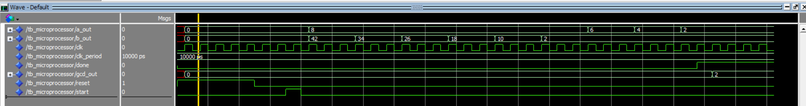

# GCD Microprocessor Project

## Overview
This project implements a **Greatest Common Divisor (GCD)** calculator on a simple microprocessor architecture using **VHDL**.  
The design is split into three main modules:
- **Datapath**
- **Control Unit**
- **Memory**

A testbench is provided to simulate the GCD algorithm using the subtraction method.

---

## Algorithm (Subtraction-based GCD)
1. Load input values `A` and `B` from memory.
2. While `B` ≠ 0:
   - If `A > B` then `A := A - B`
   - Else `B := B - A`
3. When `B = 0`, the result is `GCD = A`.

---

## Example Simulation
For inputs **A = 42** and **B = 8**:  

```
(42, 8) -> (34, 8) -> (26, 8) -> (18, 8) -> (10, 8) -> (2, 8) -> (2, 6) -> (2, 4) -> (2, 2) -> (2, 0)
GCD = 2
```

---

## Simulation Result

Below is the simulation waveform when running the testbench with inputs `A=42` and `B=8`:



---

## How to Run

1. Open the project in **ModelSim/QuestaSim**.
2. Compile all VHDL files (`datapath.vhd`, `control_unit.vhd`, `memory.vhd`, `microprocessor.vhd`, `tb_microprocessor.vhd`).
3. Run the simulation of `tb_microprocessor`.
4. Observe the signals `a_out`, `b_out`, `gcd_out`, and `done` in the waveform.

---

## Expected Outputs
- For `A=48, B=18`: **GCD = 6**
- For `A=42, B=8`: **GCD = 2**

---

## Author
Project developed for practicing **Digital Design with VHDL**.
